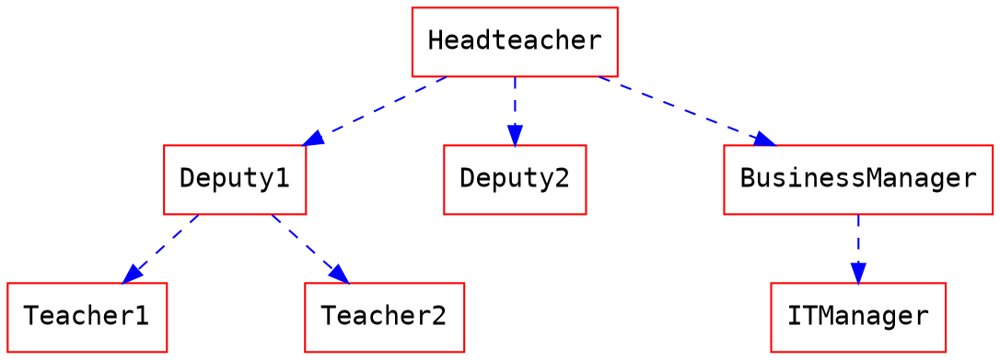
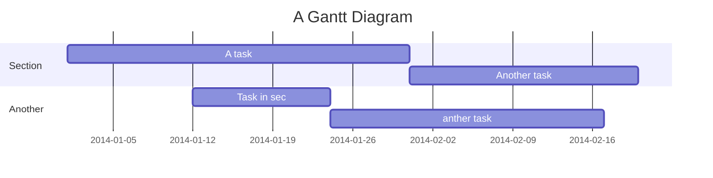
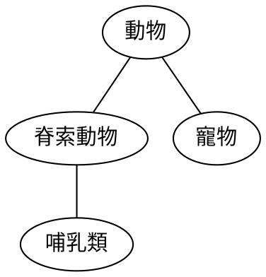
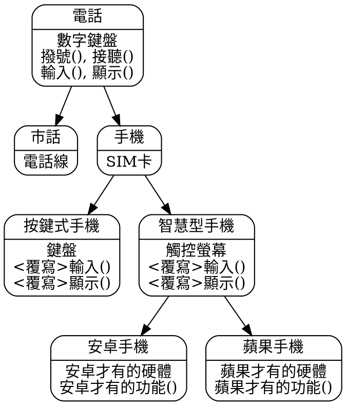

# GitProjectTutorialExample
[](https://travis-ci.org/alex850111/GitProjectTutorialExample)

HackMD
===

[TOC]

標題
===
```
# H1
## H2
### H3
#### H4
##### H5
###### H6
```
結果：

# H1
## H2
### H3
#### H4
##### H5
###### H6

清單
===
```
+ 無序清單
- 無序清單
    + 無序清單
* 無序清單
    * 無序清單
        + 無序清單

1. 有序清單
2. 有序清單
    1. 有序清單
        1. 有序清單
    3. 有序清單
```
結果：

+ 無序清單
- 無序清單
    + 無序清單
* 無序清單
    * 無序清單
        + 無序清單


1. 有序清單
2. 有序清單
    1. 有序清單
        1. 有序清單
    3. 有序清單


引用
===
```
> 引用區塊
> > 巢狀引用區塊
```
結果：

> 引用區塊
> > 巢狀引用區塊

## 引用區塊標籤
```
> 您可以使用以下語法，表明自己的 **姓名、時間與顏色** 並與其他的引用區塊做區別
> [name=ChengHan Wu] [time=Sun, Jun 28, 2015 9:59 PM] [color=#907bf7]
> > 也支援巢狀引用區塊喔！
> > [name=ChengHan Wu] [time=Sun, Jun 28, 2015 10:00 PM] [color=red]

```
結果：

> 您可以使用以下語法，表明自己的 **姓名、時間與顏色** 並與其他的引用區塊做區別
> [name=ChengHan Wu] [time=Sun, Jun 28, 2015 9:59 PM] [color=#907bf7]
> > 也支援巢狀引用區塊喔！
> > [name=ChengHan Wu] [time=Sun, Jun 28, 2015 10:00 PM] [color=red]


圖片
===
## 一般圖片


+ 指定大小


    :::warning
    設定大小要注意比例
    
    :::

## gif也OK


連結
===
[SHOPBACK](https://www.shopback.com.tw/) 

水平分隔線
===
```
---
___
***
```
結果：

---
___
***


### 強調

**這是粗體文字**

__這是粗體文字__

*這是斜體文字*

_這是斜體文字_

~~這是刪除文字~~

上標： 19^th^

下標： H~2~O

++這是底線文字++

==這是標記文字==

{旁註標記|測試}


程式碼
===
行內 `程式碼`

縮排程式碼

    // Some comments
    line 1 of code
    line 2 of code
    line 3 of code


程式碼區塊

```
Sample text here...
```

語法標色

```javascript=
var foo = function (bar) {
  return bar++;
};

console.log(foo(5));
```

```python
def foo(bar):
    return bar + 1
    
print(foo(5))
```

加上行數

```javascript=
var foo = function (bar) {
  return bar++;
};

console.log(foo(5));
```

```python=10
def foo(bar):
    return bar + 1
    
print(foo(5))
```

checkbox
===
- [x] 待辦
  - [ ] 買些沙拉
  - [ ] 刷牙
  - [ ] 喝水

警告區塊
===
:::success
耶 :tada:
:::

:::info
這是訊息 :mega:
:::

:::warning
注意 :zap:
:::

:::danger
喔不 :fire:
:::

:::spoiler 點選顯示更多內容
找到我了！ :stuck_out_tongue_winking_eye:
:::

:::spoiler {state="open"} 預設展開摺疊內容
找到我了！ :stuck_out_tongue_winking_eye:
:::


表格
===
預設
| 選項 | 描述 |
| ------ | - |
| data   | path to data files to supply the data that will be passed into templates. |
| engine | engine to be used for processing templates. Handlebars is the default. |
| ext    | extension to be used for dest files. |

向右對齊

| 選項 | 描述 |
| ------:| -----------:|
| data   | path to data files to supply the data that will be passed into templates. |
| engine | engine to be used for processing templates. Handlebars is the default. |
| ext    | extension to be used for dest files. |

向左對齊

| 選項 | 描述 |
|:------ |:----------- |
| data   | path to data files to supply the data that will be passed into templates. |
| engine | engine to be used for processing templates. Handlebars is the default. |
| ext    | extension to be used for dest files. |

置中對齊

| 選項 | 描述 |
|:------:|:-----------:|
| data   | path to data files to supply the data that will be passed into templates. |
| engine | engine to be used for processing templates. Handlebars is the default. |
| ext    | extension to be used for dest files. |


嵌入外部資源
===
## Youtube


## Vimeo


## Gist


## SlideShare


## Speakerdeck


## PDF
**注意：請使用 https 的網址，否則可能會被您的瀏覽器阻擋載入**



MathJax
===
您可以使用 **MathJax** 語法 來產生 *LaTeX* 數學表達式，如同 [math.stackexchange.com](http://math.stackexchange.com/)，但是開始的 `$` 後面以及結尾的 `$` 前面不能有空白：

The *Gamma function* satisfying $\Gamma(n) = (n-1)!\quad\forall n\in\mathbb N$ is via the Euler integral

使用區塊層級的數學式時，請在您的數學式之前與之後給予 `$$` 以及換行：

$$
x = {-b \pm \sqrt{b^2-4ac} \over 2a}.
$$

$$
\Gamma(z) = \int_0^\infty t^{z-1}e^{-t}dt\,.
$$

> 更多關於 **LaTeX** 數學表達式 [請至這裡](http://meta.math.stackexchange.com/questions/5020/mathjax-basic-tutorial-and-quick-reference)


UML 圖表
===
## 循序圖

您可以像是以下使用循序圖：

```sequence
艾莉絲->包柏: 哈摟，你好嗎？
Note right of 包柏: 包柏思考中
包柏-->艾莉絲: 我很好，謝謝！
Note left of 艾莉絲: 艾莉絲回應
艾莉絲->包柏: 最近過得怎樣？
```

## 流程圖

您可以像是以下使用流程圖：
```flow
st=>start: 開始
e=>end: 結束
op=>operation: 我的操作
op2=>operation: 啦啦啦
cond=>condition: 是或否？

st->op->op2->cond
cond(yes)->e
cond(no)->op2
```

## Graphviz


## Mermaid


## Abc
```abc
X:1
T:Speed the Plough
M:4/4
C:Trad.
K:G
|:GABc dedB|dedB dedB|c2ec B2dB|c2A2 A2BA|
GABc dedB|dedB dedB|c2ec B2dB|A2F2 G4:|
|:g2gf gdBd|g2f2 e2d2|c2ec B2dB|c2A2 A2df|
g2gf g2Bd|g2f2 e2d2|c2ec B2dB|A2F2 G4:|
```

## Vega-Lite
```vega
{
  "$schema": "https://vega.github.io/schema/vega-lite/v4.json",
  "data": {"url": "https://vega.github.io/editor/data/barley.json"},
  "mark": "bar",
  "encoding": {
    "x": {"aggregate": "sum", "field": "yield", "type": "quantitative"},
    "y": {"field": "variety", "type": "nominal"},
    "color": {"field": "site", "type": "nominal"}
  }
}
```

## 之前的東西




> 更多關於 **循序圖** 語法 [在這裡](http://bramp.github.io/js-sequence-diagrams/).
> 更多關於 **流程圖** 語法 [在這裡](http://adrai.github.io/flowchart.js/).
> 更多關於 **graphviz** 語法 [在這裡](http://www.tonyballantyne.com/graphs.html)
> 更多關於 **mermaid** 語法 [在這裡](http://mermaid-js.github.io/mermaid)
> 更多關於 **abc** 語法 [在這裡](http://abcnotation.com/learn)
> 更多關於 **vega** 語法 [在這裡](https://vega.github.io/vega-lite/docs)


